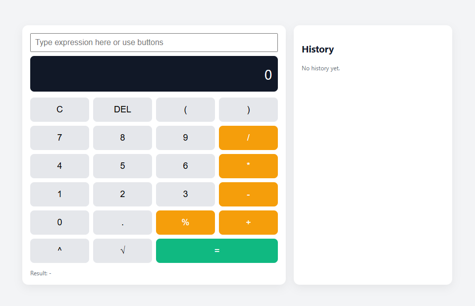

# 📟 MERN Stack Calculator

A simple and efficient Calculator Application built using the MERN Stack (MongoDB, Express.js, React.js, Node.js).
This project demonstrates full-stack development concepts such as API integration, state management, UI handling, and deployment structure.

## 🚀 Features

Basic calculator operations
➤ Addition
➤ Subtraction
➤ Multiplication
➤ Division

Clean and responsive UI

Fast performance using React

Backend API setup using Express & Node

MongoDB structure ready for future expansion

Error handling & validations

Fully customizable

## 🛠️ Tech Stack
### Frontend

React.js

HTML / CSS

JavaScript

Axios (for API calls)

### Backend

Node.js

Express.js

### Database

MongoDB (Mongoose)

## 📁 Folder Structure
mern-calculator/
│
├── client/        # React Frontend
│   ├── public/
│   └── src/
│       ├── components/
│       ├── App.js
│       └── index.js
│
├── server/        # Node & Express Backend
│   ├── routes/
│   ├── controllers/
│   ├── models/
│   └── server.js
│
└── package.json

## ⚙️ Installation & Setup
### 1️⃣ Clone the Repository
git clone https://github.com/Lahari-Pandiri/MERN_Calculator.git

### 2️⃣ Install Frontend Dependencies
cd client
npm install

### 3️⃣ Install Backend Dependencies
cd ../server
npm install

### 4️⃣ Start the Frontend
npm start

### 5️⃣ Start the Backend
node server.js

## 📸 Screenshots (Add Your UI Images)
### 

## 💡 Future Enhancements

Scientific calculator

Dark/Light theme

User history stored in MongoDB

Keyboard support

Deployment with Vercel / Render

## 🤝 Contributing

Pull requests are welcome.
If you want to make changes, create a new branch and submit a PR.

## ⭐ Show Some Support

If you like this project, give it a star ⭐ on GitHub!
